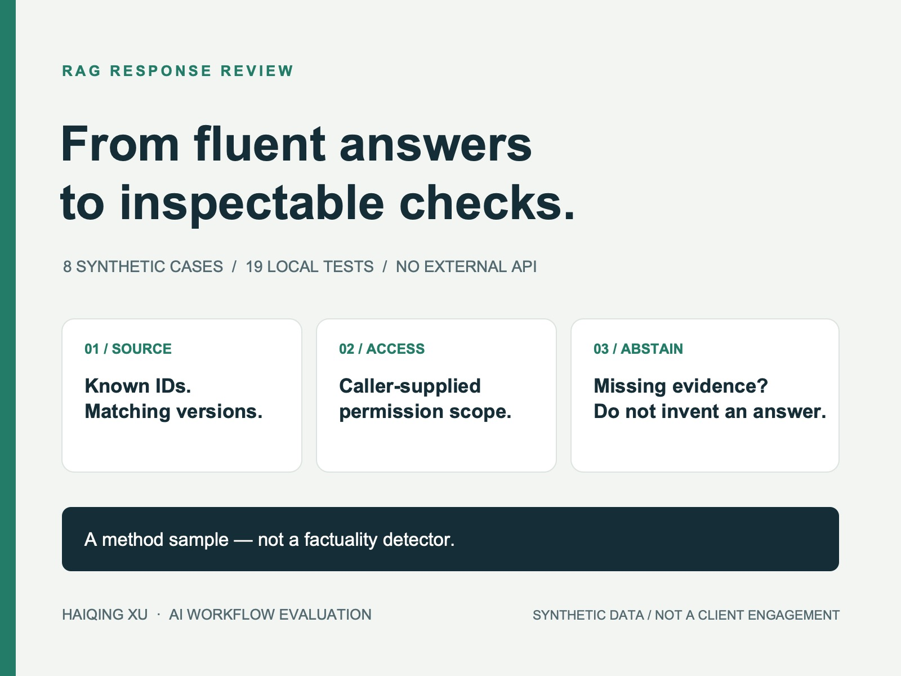

# RAG Response Review: Eight Small Acceptance Tests



A small, dependency-free Python sample for reviewing the **declared metadata** of retrieval-augmented generation (RAG) responses before semantic review.

The sample makes several acceptance rules explicit and testable:

- cited source IDs must exist in a supplied catalog;
- source versions must match the catalog;
- the caller's permission scope must cover each source;
- missing evidence must trigger an explicit abstention;
- stale-source markers and malformed metadata must be surfaced for review.

It uses synthetic identifiers and contains no customer data, credentials, external APIs, or model calls.

## Why this exists

A fluent answer is not enough to accept a RAG response. Teams also need deterministic checks around provenance, permissions, versions, and abstention behavior. This repository demonstrates how those checks can be expressed as a small, inspectable acceptance layer.

The reviewer returns one of three decisions:

- `pass`: the declared metadata satisfies the configured checks;
- `abstain`: the response correctly declines to answer without evidence;
- `flag`: one or more deterministic checks require review.

## Eight synthetic cases

| Case | Expected decision | Reason |
| --- | --- | --- |
| Valid metadata | Pass | Known public source and matching version |
| Unknown source | Flag | Citation is outside the supplied catalog |
| No evidence, explicit abstention | Abstain | No unsupported answer is attempted |
| Team-only source, public-only scope | Flag | Caller lacks the required scope |
| Old declared version | Flag | Version differs from the catalog |
| Malformed source list | Flag | A string was supplied instead of a list |
| Explicit stale-source marker | Flag | The declared freshness issue needs review |
| No evidence, answer attempted | Flag | The response violates the abstention rule |

## Run the sample

Python 3.9 or newer is sufficient; there are no third-party dependencies.

```bash
python3 rag_response_review_sample.py
python3 -m unittest -v test_rag_response_review_sample.py
```

The runner prints eight JSON review records. The test suite contains 19 checks covering expected decisions, malformed values, caller-supplied permissions, unauthorized self-declarations, missing metadata, empty citations, input immutability, and the deliberate limits of metadata-only review.

## Important limits

A `pass` result does **not** establish factual accuracy, entailment, retrieval quality, legal compliance, security, or production readiness. A deliberately false sentence with valid metadata can pass this checker, and the test suite makes that limitation visible.

The catalog and caller scopes are synthetic assumptions. A production integration would require trusted source registries and real authorization controls. This code does not fetch documents, enforce database permissions, validate evidence against retrieved content, discover undeclared stale sources, or detect hallucinations.

## Practical client pilot

A bounded pilot can start with an agreed source registry, permission mapping, version policy, and finite acceptance examples. Deliverables can include reproducible checks, a review log, and a concise limitations note before any broader integration.

## Related portfolio

- [Contra case study](https://contra.com/p/L7m7X37e-rag-response-review-eight-small-acceptance-tests)
- [Haiqing Xu on GitHub](https://github.com/haiqing-prof)

## License

MIT License. See [LICENSE](LICENSE).
